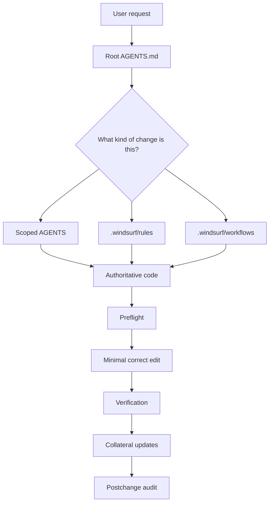

# iNiR — AGENTS.md (Root)

Este archivo es el **contrato operativo always-on** para agentes trabajando en iNiR.

iNiR es un **desktop shell completo** construido sobre **Quickshell (Qt6/QML)** para **Niri** en Wayland, con compatibilidad parcial en Hyprland para superficies heredadas. El repo contiene runtime QML, servicios singleton, módulos UI, scripts, defaults, instalador/updater, distribución y documentación.

---

## 1) Alcance, precedencia y propósito

### Alcance

- Este `AGENTS.md` root aplica a **todo el repo**.
- Los `AGENTS.md` scoped agregan reglas locales para:
  - `modules/`
  - `modules/common/`
  - `modules/waffle/`
  - `services/`
  - `scripts/`
  - `docs/`
- `.windsurf/rules/` contiene steerings reutilizables y profundos por tema.
- `.windsurf/workflows/` contiene procedimientos paso a paso para tareas repetibles.

### Precedencia

Usá este orden cuando varias fuentes hablen del mismo tema:

1. **Código verificado y runtime real**
2. **Este `AGENTS.md` root**
3. **`AGENTS.md` scoped del directorio tocado**
4. **`.windsurf/rules/*.md` relevantes**
5. **`.windsurf/workflows/*.md`**
6. **Docs contributor-facing (`agents/docs/`, `docs/`)**
7. **Memorias / contexto histórico**

Si dos capas chocan, prevalece la más cercana al comportamiento real y verificable.

### Regla editorial

- Lo **global, estable y transversal** vive acá.
- Lo **local por directorio** vive en el `AGENTS.md` scoped.
- Lo **temático y profundo** vive en `.windsurf/rules/`.
- Lo **procedural / checklist** vive en `.windsurf/workflows/`.
- Las docs user-facing no deben convertirse en basurero de proceso interno.

---

## 2) Cómo Windsurf y los MCP deben leer iNiR



### Regla de lectura

- No edites “desde memoria”.
- No infieras APIs sin confirmarlas.
- No asumas que una regla vieja sigue vigente sólo porque existe.
- No asumas que una doc contributor-facing reemplaza al código.

### Herramientas esperadas

- **Contexto de repo**: `mcp7_*`
- **Steerings / memoria de proceso**: `mcp6_*`
- **Exploración amplia**: `code_search`
- **Búsquedas puntuales**: `grep_search`

---

## 3) Qué es iNiR (modelo mental)

Pensalo como una cadena de responsabilidad:

`Config + Services + Singletons comunes -> Shell composition -> Modules/UI -> comportamiento visible`

### Qué hace cada capa

- **Config**
  - persistencia de intención del usuario
  - schema y defaults
  - no debe “adivinarse” desde componentes

- **Services**
  - integraciones con sistema/compositor
  - estado runtime compartido
  - side effects, polling, IPC, filesystem

- **Shell composition**
  - decide qué familia se carga
  - coordina startup, paneles, loaders, overlay y family switching

- **Modules**
  - UI visible
  - render, interacción, layout y estados
  - no son la fuente global de verdad

- **Scripts / setup / distribution**
  - borde con el sistema
  - theming, captura, traducción, instalación, migraciones, packaging

---

## 4) Topología del repo y entry points

### Entry points raíz

- `shell.qml`
  - root del shell
  - instancia servicios críticos
  - espera `Config.ready`
  - aplica tema
  - expone IPC shell-level

- `ShellIiPanels.qml`
  - compone familia `ii`

- `ShellWafflePanels.qml`
  - compone familia `waffle`

### Invariantes de arquitectura

- Sólo **una familia principal** debe estar activa a la vez.
- `ii` y `waffle` **no son estilos**; son familias.
- Los estilos globales son:
  - `material`
  - `cards`
  - `aurora`
  - `inir`
  - `angel`
- Las diferencias de compositor deben ir con guards explícitos.

---

## 5) Realidad de distribución y paths

### Paths importantes

- Runtime QML: `~/.config/quickshell/inir/`
- Config de usuario: `~/.config/illogical-impulse/config.json`
- Estado runtime: `~/.local/state/quickshell/user/`
- Cache: `~/.cache/quickshell/inir/`

### Implicancias

- `~/.config/illogical-impulse/config.json` es **legacy pero vigente**.
- No “modernices” paths en docs o reglas si el runtime real todavía usa el namespace legacy.
- En algunos setups, `~/.config/quickshell/inir` puede ser symlink al checkout del repo.
- No trates repo y runtime como árboles distintos si en ese entorno son el mismo árbol.

---

## 6) Reglas de fuente de verdad por capa

### Config

`modules/common/Config.qml` es la autoridad.

- Lectura: `Config.options?.path?.to?.prop ?? fallback`
- Escritura: `Config.setNestedValue("path.to.key", value)`
- Si agregás una key nueva, el trabajo está incompleto si no tocaste:
  - `modules/common/Config.qml`
  - `defaults/config.json`
  - consumidores / settings / migraciones cuando aplique

### Appearance / Looks

- `ii` usa `Appearance.*`
- `waffle` usa `Looks.*`
- No hardcodees colores, radios o tipografías temáticas

### Services

- Si el comportamiento toca múltiples consumidores o sistema externo, probablemente la capa correcta sea `services/`
- Mantener `services/qmldir` alineado cuando agregás servicios
- IPC debe ser estable y con tipos de retorno explícitos

### Modules

- Preferir widgets compartidos antes que clones bespoke
- Considerar familias, estilos, estados vacíos, overflow, hover, active, disabled

### Scripts

- Confirmar caller real antes de editar
- Revisar shell/interpreter correcto
- Si cambia dependencia, revisar packaging y docs

### Docs

- La doc correcta refleja comportamiento verificado
- No duplicar reglas si ya existe fuente canónica
- No dejar instrucciones peleadas entre sí

---

## 7) Workflow operativo obligatorio

### Paso 1 — Clasificar el pedido

Antes de tocar nada, ubicá el pedido en una de estas categorías:

- módulo/UI
- service/IPC
- config/schema
- script/distribution
- docs/governance
- release/versioning

### Paso 2 — Encontrar la capa autoritativa

- No arregles “donde se ve” si la causa está en config, service o shell composition.
- No metas lógica de negocio en widgets compartidos.
- No metas side effects en módulos si deben vivir en services/scripts.

### Paso 3 — Releer reglas locales y patrones reales

- Leer archivo(s) reales a tocar
- Leer `AGENTS.md` scoped si aplica
- Leer steerings relevantes
- Buscar ejemplos existentes antes de inventar una variante nueva

### Paso 4 — Preflight antes de editar

- `mcp7_preflight_check(...)` para archivos del proyecto
- `mcp6_preflight_check(...)` para archivos externos / steering / memorias locales

### Paso 5 — Editar mínimo, correcto y completo

- Primero corregí la causa raíz
- Después ajustá collateral surfaces
- No hagas refactors laterales
- No entregues versiones “70%”

### Paso 6 — Verificar

#### Runtime changes

```bash
inir restart
sleep 3
inir logs | grep -iE "error|TypeError|ReferenceError|binding loop" | tail -80
```

#### Config changes

- Confirmar lectura
- Confirmar persistencia en `~/.config/illogical-impulse/config.json`
- Confirmar compatibilidad con defaults y settings

#### Script changes

- Verificar caller
- Verificar sintaxis / runtime específico
- Verificar side effects reales

#### Docs / governance changes

- Releer archivos tocados
- Hacer barrido de contradicciones
- Buscar referencias viejas si el cambio era de nomenclatura o tooling

### Paso 7 — Auditoría final

- `mcp7_postchange_audit(...)` tras cambios en repo
- `mcp6_postchange_audit(...)` tras cambios de steering externo

---

## 8) Workflows por tipo de cambio

### A. Módulo / UI

Siempre revisar:

- familia(s) afectadas
- estilos globales afectados
- estados vacíos / hover / active / overflow / disabled
- dependencia de config o service
- impacto visible real

### B. Service / IPC

Siempre revisar:

- consumidores
- `services/qmldir`
- side effects
- estabilidad del target IPC
- documentación pública si cambia la superficie callable

### C. Config / schema

Siempre revisar:

- `Config.qml`
- `defaults/config.json`
- consumidores
- settings UI
- migraciones si el cambio afecta usuarios existentes

### D. Scripts / setup / distribution

Siempre revisar:

- caller
- dependencias
- installer / updater / migrations
- `docs/PACKAGES.md` o docs de distribución cuando aplique

### E. Docs / governance

Siempre revisar:

- alcance correcto del archivo
- duplicación innecesaria
- contradicciones con otras capas
- si el contenido es realmente operativo o debería vivir en otro steering/workflow

### F. Release / versioning

No mezclar “cambio de feature” con “preparación de release”.

- Un cambio normal **no** implica automáticamente bump de `VERSION`, tag o release
- Una tarea de release está incompleta si no actualiza el grupo entero:
  - `VERSION`
  - `CHANGELOG.md`
  - tag `vX.Y.Z`
  - notas de release / PR de release

---

## 9) Sync groups y surfaces colaterales

### Si tocás config

Actualizá juntos:

- `modules/common/Config.qml`
- `defaults/config.json`
- consumers
- settings page relevante
- migración si rompe compatibilidad de usuarios existentes

### Si tocás IPC

Revisá juntos:

- `IpcHandler` real
- callers (`inir <target> <function>`, keybinds, scripts)
- `docs/IPC.md`
- changelog/release notes si es user-facing

### Si tocás services

Revisá juntos:

- service file
- `services/qmldir`
- consumers
- docs/IPC si expone surface pública

### Si tocás widgets compartidos

Revisá juntos:

- callers existentes
- compatibilidad de API
- `modules/common/widgets/qmldir` si agregás widget
- steerings/widget-api si cambió una gotcha global

### Si tocás módulos/paneles

Revisá juntos:

- shell loaders / enabledPanels / transitions si aplica
- settings/config que lo expone
- familias y estilos
- changelog si es user-facing

### Si tocás scripts/dependencias

Revisá juntos:

- caller
- setup / installer / migrations
- `docs/PACKAGES.md`
- docs de distribución / release cuando aplique

---

## 10) Git, commits, PRs, changelog, versiones, tags, releases

### Git safety

No hagas operaciones destructivas sin permiso explícito.

### Convención de commits

Formato preferido:

`type(scope): summary`

Ejemplos:

- `feat(overview): add keyboard action mode`
- `fix(waffle): close menu without stale popup reference`
- `docs(governance): rewrite release workflow`
- `chore(distribution): align package metadata`

### Qué debe contener un PR

Un PR correcto debe dejar claro:

- contexto / problema
- capa autoritativa elegida
- qué cambió
- superficies colaterales actualizadas
- riesgos / migraciones
- validación ejecutada

### CHANGELOG

- `CHANGELOG.md` sigue **Keep a Changelog**
- es una superficie de release, no un dump desordenado de commits
- si un cambio es claramente user-facing, debe quedar contemplado para release notes

### VERSION

- La versión vigente del proyecto vive en `VERSION`
- Usar **SemVer**
  - **MAJOR**: breaking changes / incompatibilidades fuertes
  - **MINOR**: features nuevas / IPC pública nueva / config pública nueva
  - **PATCH**: fixes, polish, docs/release follow-through

### Tags y releases

- Formato de tag: `vX.Y.Z`
- No crear tag si `VERSION` y `CHANGELOG.md` no reflejan exactamente ese release
- No bump de versión “porque sí” durante una tarea normal
- Si la tarea es release prep, todo el grupo debe quedar sincronizado

### GitHub contributor/community follow-through

Si un cambio vino de PR, comunidad o feature pública, considerá si corresponde reflejarlo en:

- `CHANGELOG.md`
- release notes
- docs públicas
- agradecimiento / mención comunitaria cuando el repo ya usa ese patrón

---

## 11) Errores que no hay que cometer

- Editar sin haber identificado la capa correcta
- Tocar shared/critical files sin pensar blast radius
- Inventar APIs, tokens, propiedades o comandos
- Corregir sólo `ii` cuando la request claramente afecta también `waffle`
- Hardcodear theming
- Saltarse sync groups
- Verificar sólo “que compila” y no el flujo real
- Cambiar docs o reglas sin barrer contradicciones alrededor
- Tratar release/version/changelog/tag como piezas separadas

---

## 12) Archivos de alto riesgo

Tratarlos como stability boundaries:

- `modules/common/Appearance.qml`
- `modules/common/Config.qml`
- `GlobalStates.qml`
- `services/Translation.qml`
- `modules/waffle/Looks.qml`

Regla:

- preferir cambios **add-only**
- evitar renames/reshapes
- confirmar dependientes y comportamiento real

---

## 13) Definition of Done

Una tarea en iNiR **no está terminada** si falta cualquiera de estos puntos:

- capa autoritativa confirmada
- archivos leídos de verdad
- APIs y patrones verificados
- edición mínima pero completa
- familias/estilos/estados revisados si aplica
- sync groups actualizados
- collateral surfaces actualizadas
- verificación ejecutada
- auditoría postchange ejecutada

---

## 14) Mantenimiento de esta gobernanza

Cuando agregues una regla nueva:

- ponela en la capa correcta
- evitá duplicar lo ya definido acá
- hacela específica, verificable y accionable
- si cambia cómo se trabaja el repo, actualizá también el steering o workflow correspondiente

Este archivo debe seguir siendo el **mapa maestro** de cómo se trabaja en iNiR.

